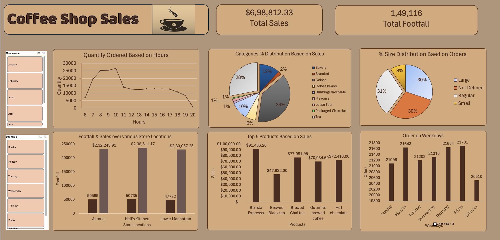

# ☕ Coffee Shop Sales Analysis Dashboard (Excel)

## 📊 Project Overview

This project presents an interactive Coffee Shop Sales Analysis Dashboard built in Microsoft Excel. The dashboard provides insights into sales performance, customer footfall, product demand, store performance, and customer purchasing behavior.

The objective is to transform raw transactional data into meaningful business insights that help optimize operations, improve product strategy, and increase sales performance.

---

## 🛠️ Tools Used

* Microsoft Excel
* Pivot Tables
* Pivot Charts
* Slicers
* Data Cleaning
* Conditional Formatting
* Dashboard Design

---

## 📈 Dashboard KPIs

* Total Sales: $698,812.33
* Total Footfall: 149,116
* Top Selling Product: Barista Espresso
* Best Performing Store: Hell's Kitchen

---

## 📷 Dashboard Preview

---

## 🔍 Key Insights

### Sales Performance

* Generated total sales of $698,812.33.
* Recorded customer footfall of 149,116 visitors.
* Morning hours between 8 AM and 10 AM experienced the highest order volume.

### Store Performance

| Store Location  | Footfall | Sales       |
| --------------- | -------- | ----------- |
| Astoria         | 50,599   | $232,243.91 |
| Hell's Kitchen  | 50,735   | $236,511.17 |
| Lower Manhattan | 47,782   | $230,057.25 |

Hell's Kitchen generated the highest revenue among all locations.

### Product Performance

#### Top Products by Sales

1. Barista Espresso – $91,406.20
2. Brewed Chai Tea – $77,081.95
3. Hot Chocolate – $72,416.00
4. Gourmet Brewed Coffee – $70,034.60
5. Brewed Black Tea – $47,932.00

### Category Analysis

Revenue contribution by category:

* Coffee: 39%
* Tea: 28%
* Bakery: 12%
* Drinking Chocolate: 10%
* Coffee Beans: 6%
* Others: 5%

Coffee products generated the highest share of total sales.

### Order Size Analysis

Order distribution:

* Regular: 31%
* Large: 30%
* Not Defined: 30%
* Small: 9%

### Weekday Analysis

* Friday recorded the highest number of orders.
* Saturday showed comparatively lower order volume.

---

## 🎯 Business Questions Answered

* Which products generate the highest revenue?
* Which store location performs best?
* What are the peak business hours?
* Which categories contribute most to sales?
* How are orders distributed by size?
* Which weekdays generate maximum customer traffic?

---

## 🧠 Skills Demonstrated

* Excel Dashboard Development
* Sales Analytics
* KPI Design
* Product Performance Analysis
* Customer Footfall Analysis
* Store Performance Analysis
* Business Reporting
* Data Visualization
* Pivot Table Analysis

---

## 👨‍💻 Author

Sachin

Aspiring Data Analyst | Excel | SQL | Power BI | Python
